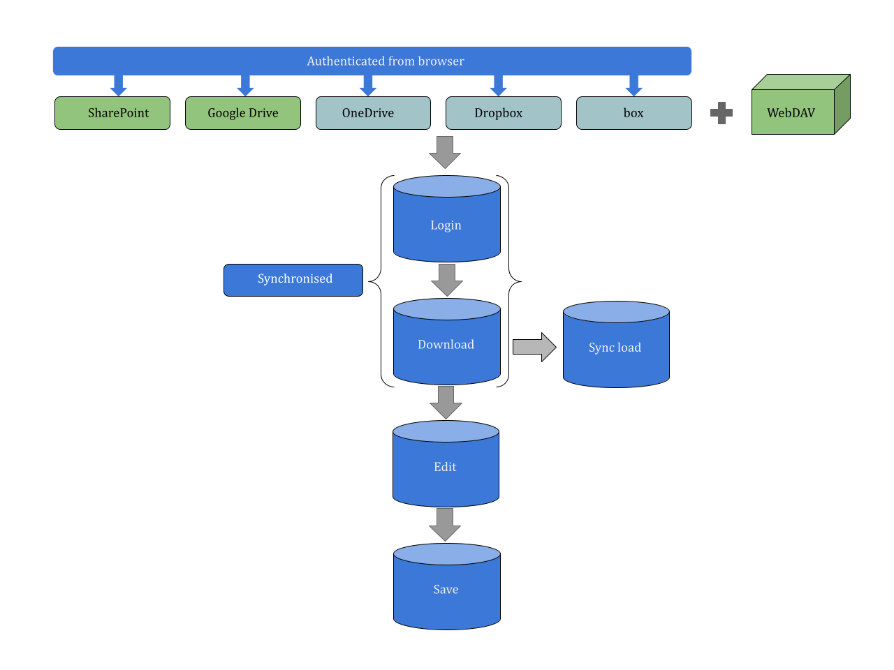
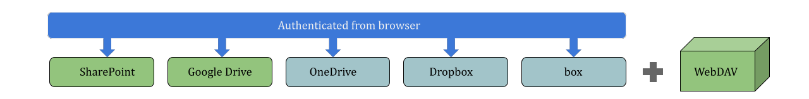
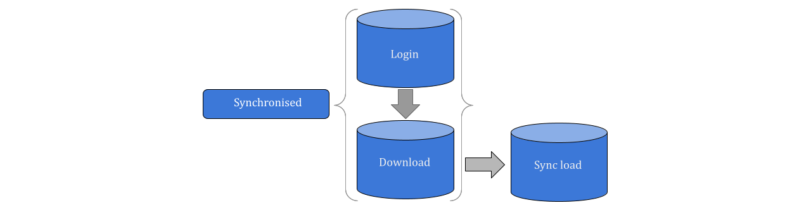
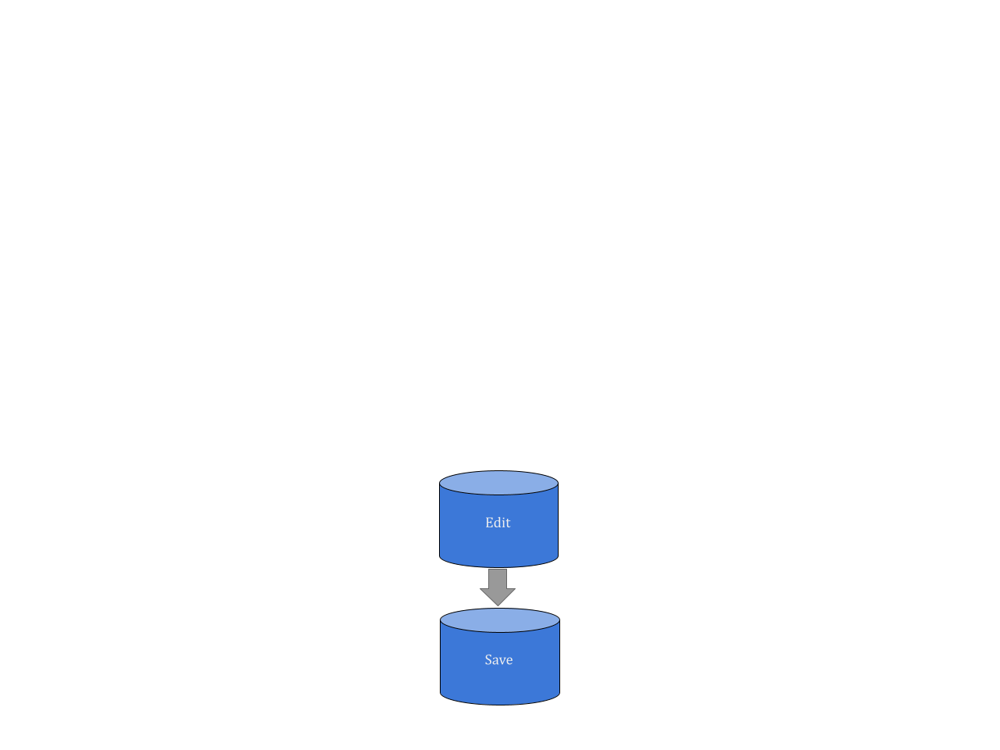

# Documentation for the FileSend Project

## Table of Contents

- [Introduction](#Intro)
- [Developer environement setup](#Dev_env)
- [Drives and File versioning](#DFv)
- [Login and Download process](#login_download)
- [Edit and Save process](#ed_sav)
- [Future possible extenstions](#ext)
- [Links](#links)

--------------------------------

## Introduction  

The goal of this project is to create an app that allows users to upload and download files from SharePoint, Google Drive, One Drive, Dropbox, to and from the users local machine. Once the login process is completed the files stored in the drives and the files stored in the shared folder of the local machine by the user are synced to match the current version stored in the cloud drives. If a user wishes to edit a file stored on the drives then they need to first checkout the file from the drive in order to ensure that only the current user is able to modify and save the file, only when the current user uploads the file back to the drive does the checkout status of the file change. This mutex/lock mechanism ensures that a file with a checkout status can only be worked upon by the user who checked out the file and at any given time only one user can edit and save changes.

Shown below is an overview of the workflow of the app. One can observe that the workflow is roughly divided into 4/5 stages where it should be noted that during the login and download steps the app synchronises the contents of the drive and the contents of the shared folder in the users local machine.

## 1. Dev environment Set-Up 

- Install latest version of QT Creator
- Install Postman
- Install WebDAV
- Familiarize with Microsoft Azure AD, Google cloud console, etc.
- Familiarize with Oauth2 process

## 2. Drives and File versioning 

- One of the main goals of this project is to connect different cloud based drives to a singular app, this allows the user to seamlessly work with multiple cloud drives and synchronise the contents in the users local machine accordingly. As shown in the diagram above we have multiple options in terms of cloud drives and in the initial phase of this project we choose to work with SharePoint and Google Drive. Using modular coding the app can be extended to accomadate other cloud drives such as OneDrive and Dropbox in the future.

- A component of this project is versioning, which means we employ the built in versioning features of the cloud services like SharePoint and Google Drive to keep track of the contents and id them. The core versioning package in WebDAV consists of the locking feature, this feature allows the user to checkout files from a system and only that user is able to edit the file until the file is saved back into the cloud. This mechanism prevents the conflict of multiple versions of a file at any given moment. The version control constraints only apply when the file is in a checked-out state.

## 3. Login and Download process

- The login phase of the app consists of the user signing in using their credentials from a browser in order to be able to interact with the files on the cloud drive. In order to maintain a secure enviornment user authentication is of utmost importance as only authenticated users can checkout a file from the drives and this requirement is fulfilled by the employment of oauth2 for authentication. For every intended type of cloud drive service the app consists of its own oauth2 flow be it for Google's Drive or Microsoft's SharePoint, this oauth2 flow consists of a combination of clientID and client secret which when excahnged gives us with the respective access token from the appropriate cloud drive service provider.

- Once the user has been authenticated the next phase of synchronisation begins concurrently. If the contents of the shared folder in the user's local machine is outdated as opposed to the contents of the folder in the cloud drive then the contents in the user's local machine is synchronised to match the cloud drive version. An important point to note is that if the reverse situation occurs, whereby the contents in the cloud drive are outdated as opposed to the contents in the local machine then the contents are not automatically synchronised. The only way contents in the cloud drive can be altered is by first downloading and changing the status of the contents to "checked-out" and once the user has edited the document and uploaded the contents back online to the drive only then would the status of the contents in the cloud drive will be reverted to "checked-in".

## 4. Edit and Save process 

- This phase can be intiated by the user once they check out the appropriate content from the respective cloud drive. An important point to consider here is that status of the checked-out content is only reverted once the user saves the content. At any given moment in time only one user can check out a file and edit it, only when the user saves the changes online is the satus of file shifted back thus allowing another user to work on the newly modified content.

- Another point to focus on is that app needs to be able to handle file associations for different file types and once the user decides to edit a specific content then appropriate associated software is initiated to allow the user to work on the content. In order to implement this developers need to pay special attention to file association settings in different OS's and cloud-drive services. Some cloud-drive services don't handle file associations and a possible way to circumvent this issue is by extending the capabilities of the app itself and the app itself provinding the user with suggestions on which appropriate tool to use in order to edit the contents.

## 6. Future possible extenstions 

- Single point of authentication for all drives

## 7. Links 

- Microsoft oauth2 flow: https://learn.microsoft.com/en-us/entra/identity-platform/v2-oauth2-auth-code-flow
- Google oauth2 flow: https://developers.google.com/identity/protocols/oauth2
- WebDAV: http://www.webdav.org/
- Web assembly: https://emscripten.org/docs/getting_started/Tutorial.html#tutorial

